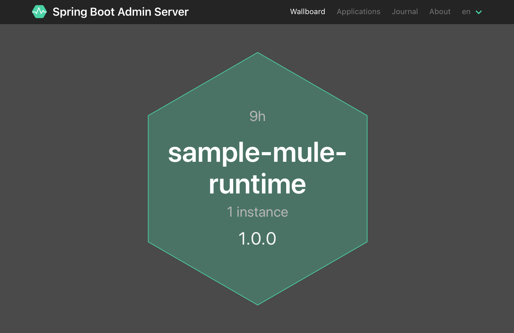
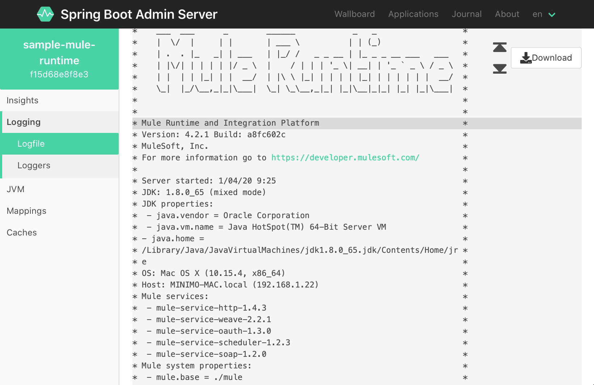
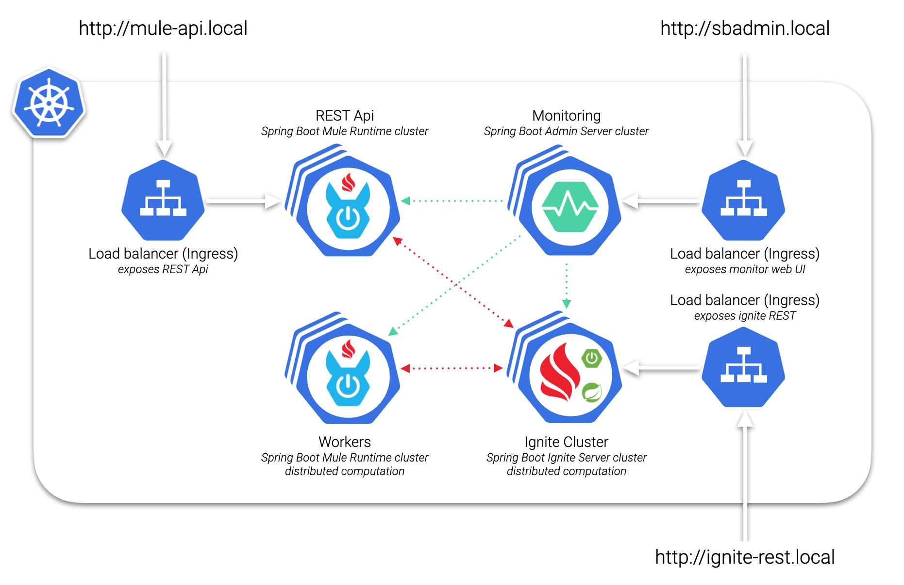

<p align="center" style="width: 200px;" markdown="1">
   
</p>

<h1 align="center">Spring Boot Starter for Mule 4</h1> 

[](https://opensource.org/licenses/Apache-2.0)
[](https://codecov.io/gh/hawkore/mule4-spring-boot-starter) 
[](https://sonarcloud.io/dashboard?id=hawkore_mule4-spring-boot-starter)

[](https://javadoc.io/doc/org.hawkore.springframework.boot/mule4-spring-boot-container)
[](https://search.maven.org/search?q=mule4-spring-boot-starter)

<p align="center"><b>A 'Bootiful' approach to run Mule 4 embedded into a Spring Boot application.</b></p>

## Table of Contents

  * [Getting Started](#getting-started)
    + [Overview](#overview)
    + [Prerequisites](#prerequisites)
        + [Dependencies](#dependencies)
        + [Mule Runtime versions](#mule-runtime-versions)
    + [Expose deployment services](#expose-deployment-services)
        + [Securing Deployment Services](#securing-deployment-services)
    + [Simple Usage example](#simple-usage-example)
    + [Kubernetes deployment example](#kubernetes-deployment-example)
  * [Appendix](#appendix)
    + [Configuration](#configuration)
    + [Help and troubleshooting](#help-and-troubleshooting)
  * [License](#license)

## Getting Started

### Overview
The goal of this starter is to join Mule's productivity with the Spring Boot ecosystem.

This will allow you to build highly productive and easily scalable systems with very interesting features:

- **Mule Runtime monitoring** with [Spring Boot Admin](https://github.com/codecentric/spring-boot-admin#codecentrics-spring-boot-admin):
    - Easy loglevel management
    - Follow and download logfile
    - JVM & memory metrics
    - Interact with JMX-beans
    - Show health status
    - ...
- **Manage Mule artifacts** (applications/domains), exposing Mule deployment services through Spring Boot REST controllers, as a stand-alone instance.
- **Easy deployment of Mule applications as micro-services** on Kubernetes or another container management platform.
- **Deploy** Mule artifacts stored in an **external repository**, see `mule.apps` and `mule.domains` properties in [Configuration](#configuration) section.
- **Improve CI/CD**, building **docker images within seconds** containing **the latest Mule Runtime version** and **deploying your Mule Applications** on a container management platform, for example **Kubernetes**, to test integrations before deploying them to production. 
- ...

### Prerequisites
The main dependency is JDK 8+. Tested with:
 - JDK 8, JDK 9, JDK 10 and JDK 11 on Linux/Mac/Windows
 - Spring Boot `2.1.0+`
 - Mule Runtime `4.2.1`-`4.5.2`
  
#### Dependencies

Add **Spring Boot starter for Mule 4** dependency to your Spring Boot application's pom.xml file:

- For Mule 4 CE Runtime (**C**ommunity **E**dition, a.k.a. **Kernel**):

    ```xml
    <dependency>
        <groupId>org.hawkore.springframework.boot</groupId>
        <artifactId>mule4-spring-boot-starter-ce</artifactId>
        <version>${mule4-spring-boot-starter.version}</version>
    </dependency>
    ```

- For Mule 4 EE Runtime (**E**nterprise **E**dition):

    ```xml
    <dependency>
        <groupId>org.hawkore.springframework.boot</groupId>
        <artifactId>mule4-spring-boot-starter-ee</artifactId>
        <version>${mule4-spring-boot-starter.version}</version>
    </dependency>
    ```

#### Mule Runtime versions

This starter will add Mule Runtime dependencies to your Spring Boot application using Mule Runtime BOM (Bill Of Materials) 
specified by mandatory `-D` command line argument `mule.bom.version` at build time, 
for example, to embed Mule Runtime 4.2.1 just run `mvn clean package -Dmule.bom.version=4.2.1`.

Check available **Mule Runtime CE BOM** versions at [MuleSoft's public maven repository](https://repository.mulesoft.org/nexus/content/repositories/releases/org/mule/distributions/mule-runtime-impl-bom/).

Take a look at [spring-boot-mule4-runtime-ce](samples/spring-boot-mule4-runtime-ce/README.md) sample project (Mule Runtime CE 4.4.0).

Take a look at [spring-boot-mule4-runtime-ee](samples/spring-boot-mule4-runtime-ee/README.md) sample project (Mule Runtime EE 4.5.2).

### Expose deployment services
Deployment services will allow you to manage Mule artifacts on a running spring-boot embedded Mule 4 Runtime:

- Deploy/un-deploy Mule Applications.
- Deploy/un-deploy Mule Domains.
- List deployed Mule Applications.
- List deployed Mule Domains.

To expose Mule 4 Runtime deployment services add `@EnableSpringMuleRuntimeDeploymentServices` annotation:
```java
@EnableSpringMuleRuntimeDeploymentServices
@SpringBootApplication
public class SpringBootEmbeddedMuleRuntime {

    public static void main(String[] args) {
        SpringApplication app = new SpringApplication(SpringBootEmbeddedMuleRuntime.class);
        app.setBannerMode(Mode.OFF);
        app.run(args);
    }

}
```

Check `org.hawkore.springframework.boot.mule.controller.MuleRuntimeDeploymentServices` implementation for more details.

#### Securing Deployment Services
Since there are several approaches on solving authentication and authorization in distributed web applications this starter doesn’t ship a default one.

A Spring Security configuration for deployment services could look like this:

```java
@Configuration(proxyBeanMethods = false)
public class SecuritySecureConfig extends WebSecurityConfigurerAdapter {
    
    @Value("${server.port}")
    private int serverPort;

    private RequestMatcher forPortAndPath(final int port, final String pathPattern) {
        return new AndRequestMatcher(forPort(port), new AntPathRequestMatcher(pathPattern));
    }
    
    private RequestMatcher forPortAndPath(final int port, final HttpMethod method, final String pathPattern) {
        return new AndRequestMatcher(forPort(port), new AntPathRequestMatcher(pathPattern, method.name()));
    }
    
    private RequestMatcher forPort(final int port) {
        return (HttpServletRequest request) -> port == request.getLocalPort();
    }


  @Override
  protected void configure(HttpSecurity http) throws Exception {

    http.authorizeRequests(
        (authorizeRequests) -> authorizeRequests.requestMatchers(forPortAndPath(serverPort, "/mule/**")).authenticated().anyRequest().denyAll()
    );
  }
}
```

See also [Securing Client Actuator Endpoints](https://codecentric.github.io/spring-boot-admin/current/#_securing_client_actuator_endpoints).

## Simple usage example

Take a look at [usage example](samples/README.md) to see how easy it is to run Mule 4 as a spring-boot application, and monitor it with [Spring Boot Admin](https://github.com/codecentric/spring-boot-admin#codecentrics-spring-boot-admin).





## Kubernetes deployment example

Take a look at the [example of distributed computation with Mule 4 and Kubernetes](https://github.com/hawkore/examples-spring-boot-mule4-kubernetes)



## Appendix

### Configuration
The additional configuration of this starter can be provided by configuration properties - the Spring Boot way.
All configuration properties start with `mule`. Below is a list of the main supported properties:

|             Property             |                                 Values                                 | Default value |
|:--------------------------------:|:----------------------------------------------------------------------:|:-------------:|
|           `mule.base`            |                   the mule's base folder (required)                    |               |
| `mule.lazyInitializationEnabled` |                            `true`, `false`                             |    `false`    |
|   `mule.xmlValidationsEnabled`   |                            `true`, `false`                             |    `true`     |
|  `mule.lazyConnectionsEnabled`   |                            `true`, `false`                             |    `true`     |
|         `mule.simpleLog`         |                            `true`, `false`                             |    `true`     |
|       `mule.cleanStartup`        |                            `true`, `false`                             |    `false`    |
|          `mule.domains`          |     comma separated mule domain file(s) to be deployed at startup      |               |
|           `mule.apps`            |   comma separated mule application file(s) to be deployed at startup   |               |
|          `mule.patches`          |    list of patches' names for Mule Runtime with high load priority     |               |
|       `mule.patchesPrefix`       |           list of patch name prefixes for auto-load patches            |  `MULE-,SE-`  |
|      `mule.autoLoadPatches`      |                            `true`, `false`                             |    `true`     |
|    `mule.autoDeployArtifacts`    |                            `true`, `false`                             |    `true`     |
|       `mule.serverPlugins`       | comma separated mule server plugins file(s) to be installed at startup |               |

- `mule.cleanStartup` will clean deployed apps and domains folders before starting Mule Runtime, this is useful to deploy Mule Runtime with your "updatable" Mule application as a micro-service.
- `mule.autoLoadPatches` will auto-load MULE PATCHES (dependencies starting with provided patches prefixes) into high priority classloader.
- `mule.autoDeployArtifacts` will auto-deploy apps and domains found within classpath as resources.
- `mule.domains`, `mule.apps` and `mule.serverPlugins` are loaded using [Spring's ResourceLoader](https://docs.spring.io/spring/docs/5.1.6.RELEASE/spring-framework-reference/core.html#resources-resourceloader), so you must provide a valid URL format:

    |   Prefix                  | Example                        | Explanation                                 |
    |:-------------------------:|:------------------------------:|:-------------------------------------------:|
    |classpath:                 |classpath:com/myapp.jar         |Loaded from the classpath.                   |
    |file:                      |file:/opt/shared/myapp.jar      |Loaded as a URL, from the filesystem.        |
    |http:                      |http://myserver/myapp.jar       |Loaded as a URL.                             |


Check `org.hawkore.springframework.boot.mule.config.MuleConfigProperties` implementation for more details.

### Help and troubleshooting

#### Build fails: mule-runtime-impl-bom not found when I try to package my Spring Boot application using starter-ce

For some Mule CE versions, MuleSoft does not release the Mule Runtime BOM to public maven repositories. To solve this:
 
- Install Mule Runtime BOM into your local maven repository by yourself:

    1. Clone [mule-distributions](https://github.com/mulesoft/mule-distributions) github project.
        ```
        git clone https://github.com/mulesoft/mule-distributions.git
        ```
    
    2. Checkout a specific Mule's Version, replace `<tag_name>` with Mule's Version you need, for example `mule-4.2.2`:
        ```
        cd mule-distributions
        git checkout <tag_name>
        ```
    
    3. Install `mule-distribution` parent pom:
        ```
        mvn clean install --non-recursive -Dmaven.test.skip=true -DskipTests=true -DskipVerifications=true -Prelease -DskipTests -DskipVerifications -DskipGpg -Dmaven.javadoc.skip=true
        ```
       
    4. Install `mule-services-all` pom:
        ```
        mvn clean install -Dmaven.test.skip=true -DskipTests=true -DskipVerifications=true -f services-all/pom.xml -Prelease -DskipTests -DskipVerifications -DskipGpg -Dmaven.javadoc.skip=true 
        ```
       
    5. Install `mule-bom` pom:
        ```
        mvn clean install -Dmaven.test.skip=true -DskipTests=true -DskipVerifications=true -f bom/pom.xml -Prelease -DskipTests -DskipVerifications -DskipGpg -Dmaven.javadoc.skip=true
        ```

## License
Copyright 2020 [HAWKORE, S.L.](https://www.hawkore.com)

Licensed under the Apache License, Version 2.0 (the "License");
you may not use this file except in compliance with the License.
You may obtain a copy of the License at

http://www.apache.org/licenses/LICENSE-2.0

Unless required by applicable law or agreed to in writing, software
distributed under the License is distributed on an "AS IS" BASIS,
WITHOUT WARRANTIES OR CONDITIONS OF ANY KIND, either express or implied.
See the License for the specific language governing permissions and
limitations under the License.


## About subcomponents
This project may contains subcomponents with separate copyright
notices and license terms. Your use of the source code for these
subcomponents is subject to their terms and conditions.
