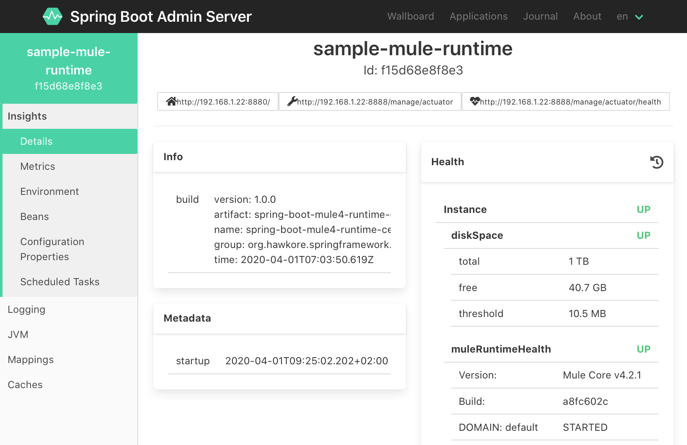

<p align="center" style="width: 200px;" markdown="1">
   
</p>

<h1 align="center">Spring Boot Starter for Mule 4</h1> 

[](https://opensource.org/licenses/Apache-2.0)
[](https://codecov.io/gh/hawkore/mule4-spring-boot-starter) 

<p align="center"><b>A 'Bootiful' approach to run Mule 4 embedded into a Spring Boot application.</b></p>

## Table of Contents

  * [Getting Started](#getting-started)
    + [Overview](#overview)
    + [Prerequisites](#prerequisites)
        + [Dependencies](#dependencies)
        + [Mule Runtime versions](#mule-runtime-versions)
    + [Enable Mule 4 Runtime](#embedded-mule-4-runtime)
    + [Expose deployment services](#expose-deployment-services)
    + [Usage example](#usage-example)
  * [Appendix](#appendix)
    + [Configuration](#configuration)
  * [License](#license)

## Getting Started

### Overview
The goal of this starter is to join Mule's productivity with the Spring Boot ecosystem.

This will allow you to build highly productive and easily scalable systems with very interesting features:

- **Mule Runtime monitoring** with [Spring Boot Admin](https://github.com/codecentric/spring-boot-admin#codecentrics-spring-boot-admin):
    - Easy loglevel management
    - Follow and download logfile
    - JVM & memory metrics
    - Interact with JMX-beans
    - Show health status
    - ...
- **Manage Mule artifacts** (applications/domains) exposing Mule deployment services through Spring boot REST controllers.
- **Easy deploy Mule applications as micro-services** in kubernetes or another container management platform.
- ...

### Prerequisites
The main dependency is JDK 8+. Tested with:
 - JDK 8, JDK 9, JDK 10 and JDK 11 on Linux.
 - Spring Boot `2.0.0+`
 
#### Dependencies

1. Add **Hawkore's public maven repository** to your Spring Boot application's pom.xml file:
    ```xml
    <repositories>
        <repository>
            <id>public.hawkore.releases</id>
            <name>Hawkore Public Repository</name>
            <url>https://repository.hawkore.com/maven2/</url>
            <layout>default</layout>
        </repository>
    </repositories>
    ```

2. Add **Spring boot starter for Mule 4** dependency to your Spring Boot application's pom.xml file:

    - For Mule 4 CE Runtime 4.2.2 (**C**ommunity **E**dition):

        ```xml
        <dependency>
            <groupId>org.hawkore.springframework.boot</groupId>
            <artifactId>mule4-spring-boot-starter-ce</artifactId>
            <version>1.0.0</version>
        </dependency>
        ```

    - For Mule 4 EE Runtime 4.2.2 (**E**nterprise **E**dition):

        ```xml
        <dependency>
            <groupId>org.hawkore.springframework.boot</groupId>
            <artifactId>mule4-spring-boot-starter-ee</artifactId>
            <version>1.0.0</version>
        </dependency>
        ```
        **NOTE**:
        
        - You will need access to mulesoft's private repository (https://repository.mulesoft.org/nexus/content/repositories/private/), 
        otherwise, try to install AnypointStudio 7+, add Mule Runtime 4.2.2 EE to AnypointStudio (or another Mule enterprise version to match the starter version you use) and 
        create from AnypointStudio a Mule Application with that Mule Runtime EE version, this should update your local maven repository with required Mule enterprise modules to build embedded Mule 4 Runtime EE as Spring Boot application ;).
        
        - To deploy and run applications on production, you will need a valid Mule EE license into the classpath of your embedded application, follow the steps at [Install an Enterprise License](https://docs.mulesoft.com/mule-runtime/4.2/installing-an-enterprise-license) and 
        [Install Enterprise License on Embedded Mule](https://docs.mulesoft.com/mule-runtime/4.2/installing-an-enterprise-license#install-enterprise-license-on-embedded-mule).

        Take a look to [spring-boot-mule4-runtime-ee](samples/spring-boot-mule4-runtime-ee/README.md) sample project.

#### Mule Runtime versions

Initial version 1.0.0 of this starter will add Mule Runtime version 4.2.2 dependencies to your Spring Boot application.

As new versions of Mule Runtime are released we will release new versions of this stater.

| Starter version      | Mule CE version (starter-ce)     | Mule EE version (starter-ee)      |
|:--------------------:|:--------------------------------:|:---------------------------------:|
| 1.0.0                | 4.2.2                            | 4.2.2                             |


### Embedded Mule 4 Runtime

To embed Mule 4 Runtime into your Spring Boot application just add `@EnableSpringMuleRuntime` annotation:
```java
@EnableSpringMuleRuntime
@SpringBootApplication
public class SpringBootEmbeddedMuleRuntime {

    public static void main(String[] args) {
        SpringApplication app = new SpringApplication(SpringBootEmbeddedMuleRuntime.class);
        app.setBannerMode(Mode.OFF);
        app.run(args);
    }

}
```

### Expose deployment services
Deployment services will allow you to manage Mule artifacts on a running spring-boot embedded Mule 4 Runtime:

- Deploy/un-deploy Mule Applications.
- Deploy/un-deploy Mule Domains.
- List deployed Mule Applications.
- List deployed Mule Domains.

To expose Mule 4 Runtime deployment services add `@EnableSpringMuleRuntimeDeploymentServices` annotation:
```java
@EnableSpringMuleRuntime
@EnableSpringMuleRuntimeDeploymentServices
@SpringBootApplication
public class SpringBootEmbeddedMuleRuntime {

    public static void main(String[] args) {
        SpringApplication app = new SpringApplication(SpringBootEmbeddedMuleRuntime.class);
        app.setBannerMode(Mode.OFF);
        app.run(args);
    }

}
```

Check `org.hawkore.springframework.boot.mule.controller.MuleRuntimeDeploymentServices` implementation for more details.

## Usage example

Take a look to [usage example](samples/README.md) to see how easy is to run Mule 4 as a spring-boot application, and monitor it with [Spring Boot Admin](https://github.com/codecentric/spring-boot-admin#codecentrics-spring-boot-admin).





## Appendix

### Configuration
The additional configuration of this starter can be provided by configuration properties - the Spring Boot way.
All configuration properties start with `mule`. Below is a list of main supported properties:

|         Property          |             Values             | Default value |
|:-------------------------:|:------------------------------:|:-------------:|
| `mule.base`               |  the mule's base folder (required)      |               |
| `mule.lazyInitializationEnabled`  |        `true`, `false`         |    `false`    |
| `mule.xmlValidationsEnabled`  |        `true`, `false`         |    `true`    |
| `mule.lazyConnectionsEnabled`  |        `true`, `false`         |    `true`    |
| `mule.simpleLog`  |        `true`, `false`         |    `true`    |
| `mule.cleanStartup`  |        `true`, `false`         |    `false`    |
| `mule.domains`  |       comma separated mule domain file(s) to deploy at startup        |       |
| `mule.apps`  |        comma separated mule application file(s) to deploy at startup        |       |
| `mule.patches`  |        list of patches' names for Mule Runtime with high load priority        |       |

- `mule.cleanStartup` will clean deployed apps and domains folders before start Mule Runtime, this is useful to deploy Mule Runtime with your "updatable" Mule application as a micro-service.
- `mule.domains` and  `mule.apps` are loaded using [Spring's ResourceLoader](https://docs.spring.io/spring/docs/5.1.6.RELEASE/spring-framework-reference/core.html#resources-resourceloader):

    |   Prefix                  | Example                        | Explanation                                 |
    |:-------------------------:|:------------------------------:|:-------------------------------------------:|
    |classpath:                 |classpath:com/myapp.jar         |Loaded from the classpath.                   |
    |file:                      |file:/opt/shared/myapp.jar      |Loaded as a URL, from the filesystem.        |
    |http:                      |http://myserver/myapp.jar       |Loaded as a URL.                             |


Check `org.hawkore.springframework.boot.mule.config.MuleConfigProperties` implementation for more details.

## License
Copyright 2018 HAWKORE, S.L.

Licensed under the Apache License, Version 2.0 (the "License");
you may not use this file except in compliance with the License.
You may obtain a copy of the License at

http://www.apache.org/licenses/LICENSE-2.0

Unless required by applicable law or agreed to in writing, software
distributed under the License is distributed on an "AS IS" BASIS,
WITHOUT WARRANTIES OR CONDITIONS OF ANY KIND, either express or implied.
See the License for the specific language governing permissions and
limitations under the License.


## About subcomponents
This project may contains subcomponents with separate copyright
notices and license terms. Your use of the source code for the these
subcomponents is subject to the terms and conditions of them.
