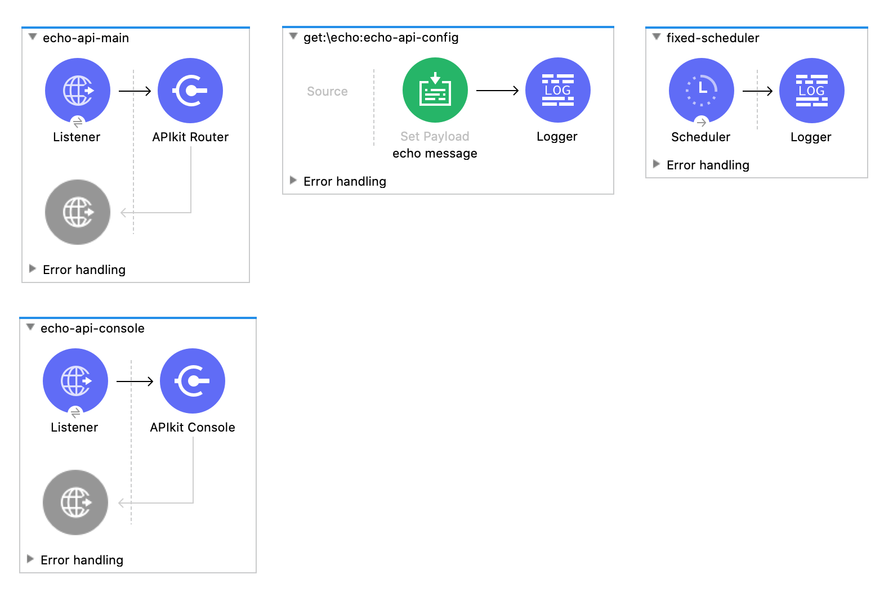
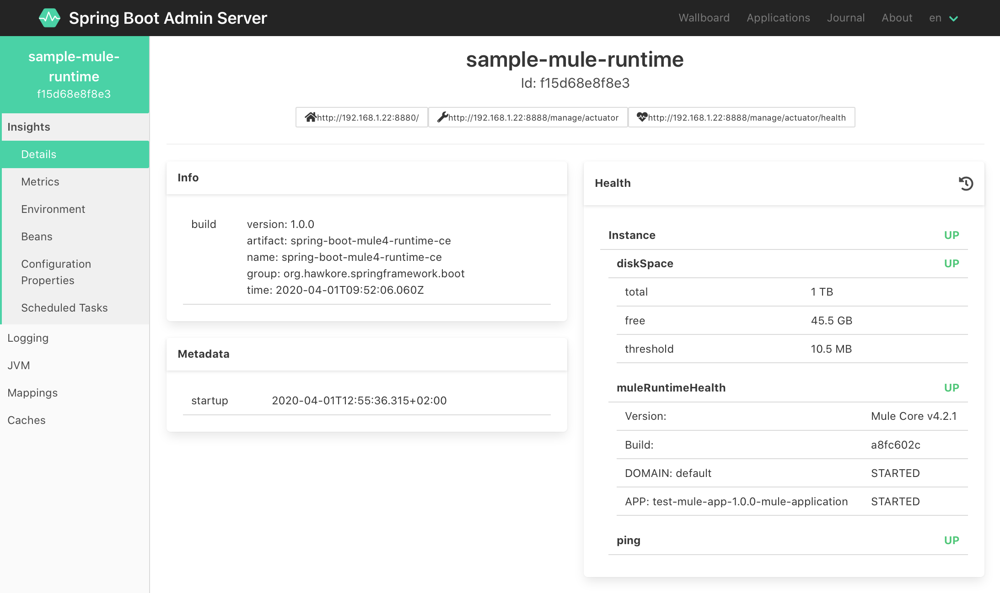
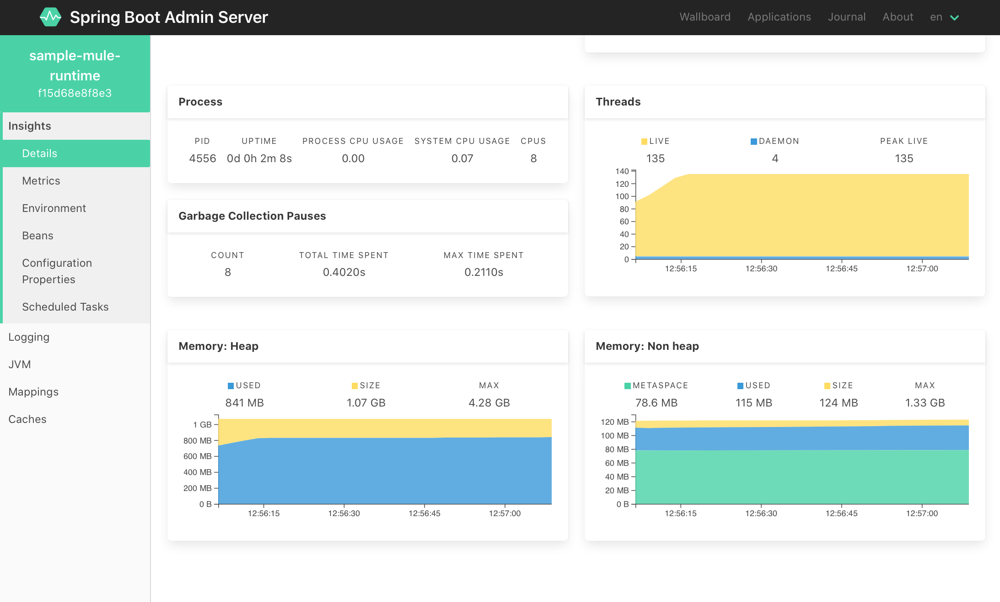
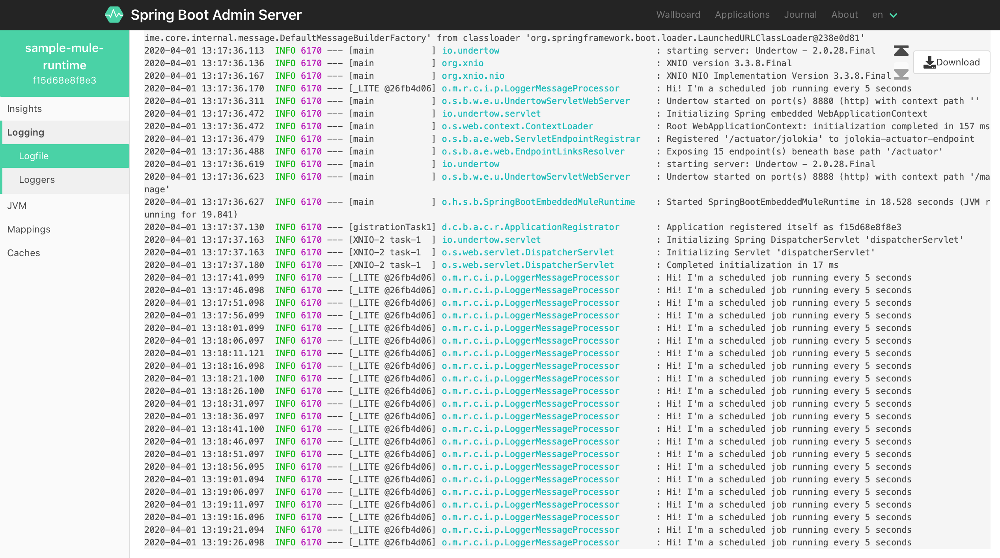
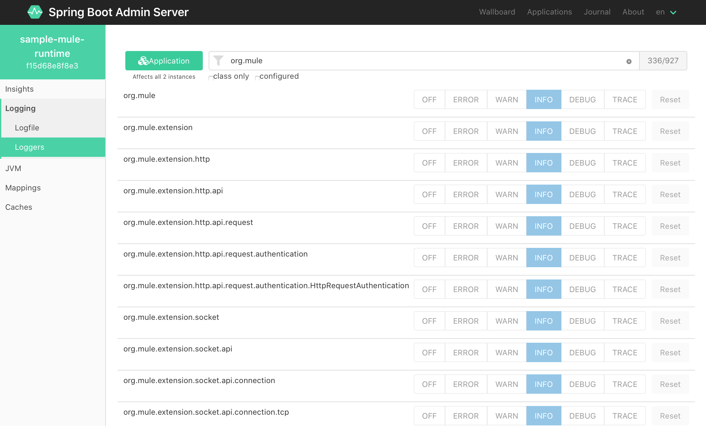
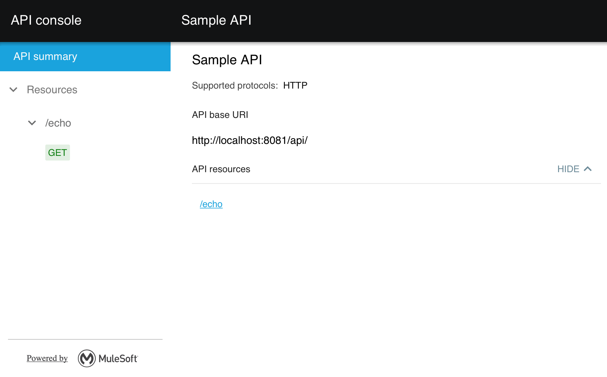

# Spring boot starter for Mule 4 usage example

In this example we are going to:

- build a Sample Mule application to run into Spring boot Mule 4 Runtime
- build and run Spring boot Admin server to monitor Spring boot Mule 4 Runtime
- build Spring boot Mule 4 Runtime and run Sample Mule application.
- Optionally, build docker images and deploy docker compose.

## Sample Mule application

This Mule application contains a simple 'echo' API (APIKit router + APIKit console) exposed on port 8081 and a simple fixed scheduler.



Build sample Mule application `test-mule-app`. 

``` bash
cd test-mule-app
mvn clean package
```

## Spring boot Admin server

Build and run `spring-boot-admin-server`:

``` bash
cd spring-boot-admin-server
mvn clean package
java -jar target/spring-boot-admin-server-1.0.0.jar
```

## Spring boot Mule 4 Runtime CE

Build `spring-boot-mule4-runtime-ce`:

``` bash
cd spring-boot-mule4-runtime-ce
mvn clean package -Dmule.bom.version=4.2.2-hf5
```

Run Sample Mule application:

``` bash
java -Dmule.base=./test/mule -Dmule.apps=file:../test-mule-app/target/test-mule-app-1.0.0-mule-application.jar -Dmule.cleanStartup=true -jar target/spring-boot-mule4-runtime-ce-4.2.2.jar
```

Open your browser [http://localhost:8882](http://localhost:8882) to access Spring Boot Admin Server:






Open your browser [http://localhost:8081/console](http://localhost:8081/console) to access **sample Mule application api console**.



## Appendix

### Optional: Build docker images, deploy compose and test

1. Ensure sample Mule application `test-mule-app` is built:

    ``` bash
    cd test-mule-app
    mvn clean package
    ```

2. Activate `docker` maven profile to install the docker image for **Spring boot Admin server**:

    ``` bash
    cd spring-boot-admin-server
    mvn clean install -Pdocker
    ```

3. Activate `docker` maven profile to install the docker image for **Spring boot Mule 4 Runtime**:

    ``` bash
    cd spring-boot-mule4-runtime-ce
    mvn clean install -Pdocker -Dmule.bom.version=4.2.2-hf5
    ```

4. Run [sample docker compose](sample-docker-compose.yml):

    ``` bash
    docker-compose -f sample-docker-compose.yml --project-name my-mule4-stack up -d
    ```

5. Open your browser [http://localhost:8882](http://localhost:8882) to access **Spring Boot Admin Server**.

6. Open your browser [http://localhost:8081/console](http://localhost:8081/console) to access **sample Mule application api console**.

### Optional: Build and test Spring boot Mule 4 Runtime EE

Take a look to [spring-boot-mule4-runtime-ee](spring-boot-mule4-runtime-ee/README.md) sample project.

### Optional: Spring boot Mule 4 Runtime with Hawkore's cluster core extension

Cluster core extension turns, transparently, Mule Runtime into a high performance clustered and horizontally scalable system.
Once activated, Mule's VM queues and ObjectStores are turned into full clustered structures. 

Take a look to [product documentation](https://www.hawkore.com/product-extensions/product/pe-mule/pe-p-mulev4) for more details.

Build and run `spring-boot-mule4-runtime-ce` with Hawkore's cluster core extension:

``` bash
cd spring-boot-mule4-runtime-ce
mvn clean package -Phk-cluster-ext -Dmule.bom.version=4.2.2-hf5
java -Dmule.base=./test/mule -Dmule.ignite.cluster.configfile=[FULL PATH TO MULE BASE]/conf/ignite-mule-config-local-test.xml -jar target/spring-boot-mule4-runtime-ce-4.2.2.jar
```

NOTE: For testing purposes, a "server mode" ignite configuration is used. 
On production, mule runtimes should run as "client nodes".

### Distributed computation power into Mule 4
 
If you want to take full distributed computation power into your Mule's applications, check [Apache Ignite Connector for Mule 4](https://blog.hawkore.com/2020/04/27/apache-ignite-connector-mule-starting/) for more details.
